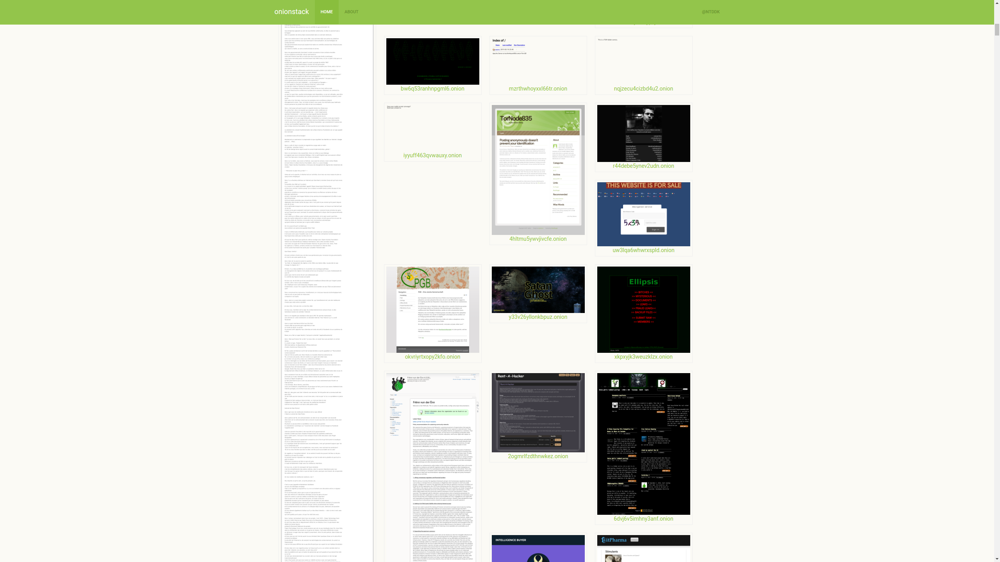

# onionstack 
onionstack is a project to create a pictorial book of Tor hidden services.<br>
You can see our sample page at [ntddk.github.io/onionstack](https://ntddk.github.io/onionstack/).



## Requirements
* Python 2.7.*
* Node.js

## Installation
```
sudo apt-get install tor
/etc/init.d tor restart
npm install -g phantomjs
pip install -r requirements.txt
python onionstack.py -c config.txt -l list.txt
```

## Contents
* `format.sh`
    - Outputs `list.txt` from given files.
* `list.txt`
    - The list of targets to crawl.
* `onionstack.py`
    - The crawler.
* `active.py`
    - Outputs `active.txt` from crawling results.
* `active.txt`
    - The list of active onion domains.
* `cbir.py`
    - Content-based image retrieval script.
* `clustering.py`
    - k-means++.
* `item.py`
    - Outputs html snippets for sample page.

## Disclaimer
This repository is for research purposes only.<br>
We do NOT in any way promote or encourage any criminal or illegal activity.

